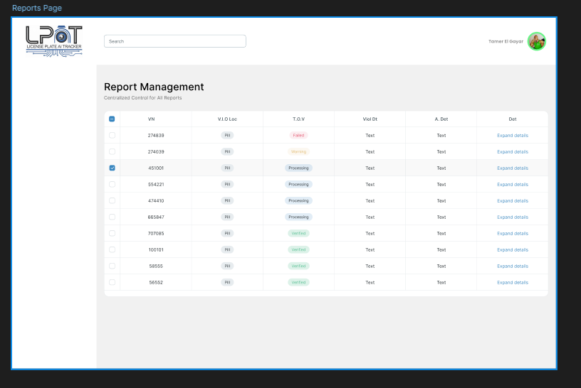

# تعديلات مطلوبة في التصميم UI/UX

## 1. تصميم جديد على Figma
- بناء تصميم جديد يحتوي على نفس المكونات الأساسية كما في تصميم عمر.

## 2. الصفحة الرئيسية
- بناء الصفحة الرئيسية كما هو موضح في الصورة المرفقة:  
  
- استخدام نظام الجريد بشكل احترافي لضمان ترتيب العناصر وتناسقها.

## 3. الجداول والتنسيق
- بناء جداول متناسقة مع ضبط الأبعاد والمسافات بشكل دقيق.
- التأكد من وضوح المعلومات وسهولة القراءة.

## 4. التصميم على شاشة MacBook Air 16
- ضبط الأبعاد والتخطيط بما يتناسب مع حجم الشاشة.
- استغلال المساحة المتوفرة بكفاءة لتوزيع العناصر.

## 5. صفحة تسجيل الدخول
- إنشاء صفحة تسجيل دخول متناسقة ومنظمة.
- يجب أن تكون الصفحة الوحيدة المخصصة لتسجيل الدخول، مع مراعاة جميع سيناريوهات الإدخال الخاطئ (مثال: إدخال نص غير صالح).

## 6. الأزرار والتفاعلات
- بناء أزرار الصفحة بشكل منظم وموحد.
- استخدام تأثيرات تفاعلية مثل hover و active لتوضيح التفاعل مع المستخدم.

## 7. ضبط أبعاد الصفحة باستخدام نظام الـ Grid
- التأكد من ضبط الأبعاد والمسافات باستخدام نظام الجريد لضمان تنسيق متناسق على جميع الشاشات.

---

# الصفحات المطلوبة

1. **صفحة تسجيل دخول الأدمن**
   - تشمل جميع السيناريوهات المحتملة للأخطاء في الإدخال.

2. **صفحة تحكم في السيارات**
   - تصميم مماثل لما هو موضح في الصورة:  
     

3. **صفحة عرض السيارات**
   - تكملة للعمل السابق، عرض السيارات في شكل جدول منسق.

4. **صفحة التحكم في الضباط**
   - إضافة رابط يقوم بإرسال الأدمن إلى إعدادات ضابط المرور.

5. **صفحة تقارير المخالفات**
   - عرض جميع المخالفات بتنسيق مرتب وسهل البحث.
    
6. **صفحة سجل التتبع والنشاطات**
   - تسجيل جميع النشاطات التي تمت على النظام وعرضها بشكل منسق.

7. **صفحة البحث المتقدم**
   - إنشاء صفحة بحث بجميع الأحداث باستخدام رقم اللوحة.

8. **صفحة البحث عن الرخص**
   - تصميم واجهة بحث واضحة وسهلة الاستخدام.

9. **صفحة البحث عن الضباط**
   - عرض بيانات الضباط مع خيارات تصفية وبحث متقدمة.

10. **صفحة عرض تاريخ السيارة**
    - عرض كافة التفاصيل المتعلقة بالمخالفات وغيرها من المعلومات التاريخية.

11. **صفحة التحكم في المستخدمين**
    - إمكانية إضافة أدمن جديد، حذف الأدمن الحالي، أو تعديل صلاحياته.

12. **صفحة إدارة الصلاحيات**
    - إنشاء صفحة خاصة لإضافة صلاحيات جديدة، حذفها، أو التعديل عليها.

---

# ملاحظات عامة

- **الثيم المستخدم:**  
  استخدام نفس ثيم "عمر" مع تحسين التناسق البصري.

- **ضبط الأبعاد:**  
  التصميم يجب أن يكون مضبوطًا بالأبعاد باستخدام نظام الجريد (Grid System) بدقة.

- **تنقل الصفحات:**  
  الاستفادة من الأحداث الموجودة في Figma لتمكين التنقل السلس بين الصفحات.

- **تناسق العناصر:**  
  استخدام نفس الأسلوب في توزيع العناصر (layout/grid) والمسافات بين الحقول والأزرار على جميع الشاشات .

- **الأيقونات والرموز:**  
  يجب استخدام أيقونات ورموز موحدة للحفاظ على انسجام التصميم.

---

# ملاحظة للمصمم

**يرجى الانتباه:** إذا لم يكن هناك تناسق في أي جزء من التصميم، فسيتم رفضه بالكامل دون استثناء. الرجاء الالتزام بجميع التفاصيل لضمان الموافقة النهائية. بالتوفيق!
يرجا التعامل مع التفاصيل بشكل دقيق وبالتوفيق

